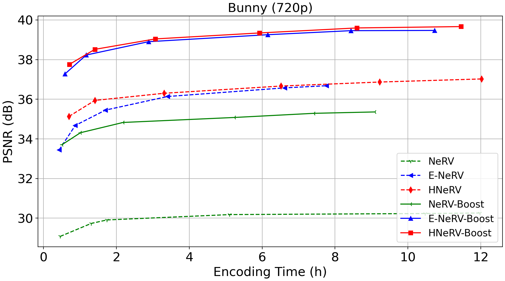
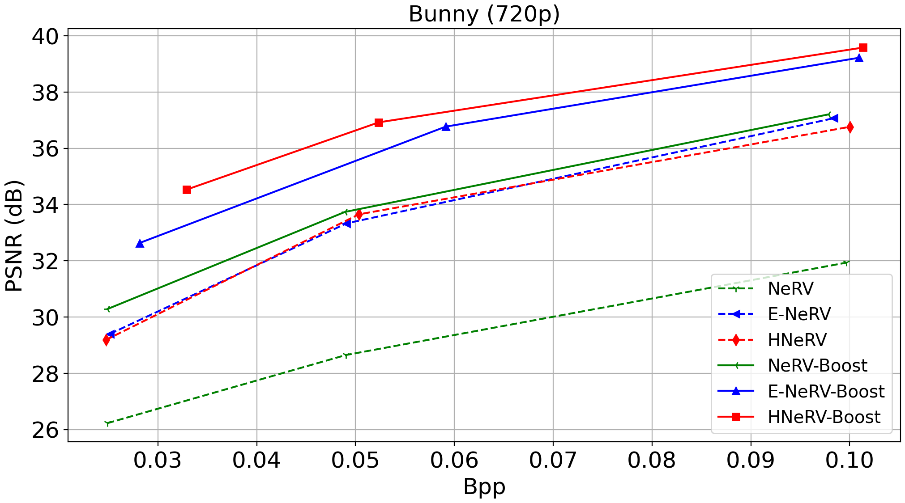
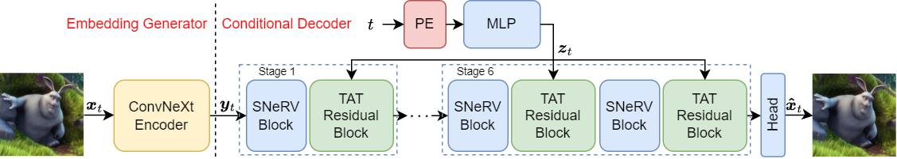

# Boosting Neural Representations for Videos with a Conditional Decoder
[](https://opensource.org/licenses/Apache-2.0) 
[](https://arxiv.org/abs/2402.18152)
[](https://github.com/Xinjie-Q/Boosting-NeRV)

[Xinjie Zhang](https://xinjie-q.github.io/), [Ren Yang📧](https://renyang-home.github.io/), [Dailan He](https://scholar.google.com/citations?user=f5MTTy4AAAAJ&hl=en), [Xingtong Ge](https://github.com/XingtongGe), [Tongda Xu](https://tongdaxu.github.io/), [Yan Wang](https://yanwang202199.github.io/), [Hongwei Qin](http://qinhongwei.com/academic/), [Jun Zhang📧](https://eejzhang.people.ust.hk/)

(📧 denotes corresponding author.)

This is the official implementation of our paper [Boosting NeRV](https://arxiv.org/abs/2402.18152), a universal and novel framework that boosting current implicit video representation approaches in the reconstruction quality and convergence speed, and exhibits superior compression, inpainting and interpolation results. More qualitative and quantitative results can be found in our paper.

<div align=center>

</div>

<div align=center>

</div>

<div align=center>

</div>

## News

* **2024/4/18**: 🔥 We release our Python code for boosting all the NeRV models presented in our paper. Have a try!

* **2024/4/5**: 🌟 Our paper has been selected as a **highlight** poster at CVPR 2024 (only top 2.8% out of over 11532 valid paper submissions)! 🎉 Cheers!

* **2024/2/27**: 🌟 Our paper has been accepted by CVPR 2024! 🎉 Cheers!

## Overview



Implicit neural representations (INRs) have emerged as a promising approach for video storage and processing, showing remarkable versatility across various video tasks. However, existing methods often fail to fully leverage their representation capabilities, primarily due to inadequate alignment of intermediate features during target frame decoding. This paper introduces a universal boosting framework for current implicit video representation approaches. Specifically, we utilize a conditional decoder with a temporal-aware affine transform module, which uses the frame index as a prior condition to effectively align intermediate features with target frames. Besides, we introduce a sinusoidal NeRV-like block to generate diverse intermediate features and achieve a more balanced parameter distribution, thereby enhancing the model's capacity. With a high-frequency information-preserving reconstruction loss, our approach successfully boosts multiple baseline INRs in the reconstruction quality and convergence speed for video regression, and exhibits superior inpainting and interpolation results. Further, we integrate a consistent entropy minimization technique and develop video codecs based on these boosted INRs. Experiments on the UVG dataset confirm that our enhanced codecs significantly outperform baseline INRs and offer competitive rate-distortion performance compared to traditional and learning-based codecs. 


## Quick Started

After cloning the repository, you can follow these steps to train boosted NeRV models under different tasks. 

### Requirements

```bash
pip install -r requirements.txt
```

If you encounter errors while installing the packages listed in requirements.txt, you can try installing each Python package individually using the pip command.

Before training, you need to download the bunny, UVG and DAVIS validation datasets. The dataset folder is organized as follows.

```bash
├── dataset
│   | bunny 
│     ├── 0001.png
│     ├── 0002.png 
│     ├── ...
│   | UVG_Full
│     ├── Beauty_1920x1080_120
│         ├── 001.png
│         ├── 002.png 
│         ├── ...
│     ├── Bosphorus_1920x1080_120
│     ├── ...
│   | DAVIS
│     ├── JPEGImages
│       ├── 1080p
│           ├── blackswan
│               ├── 00000.jpg
│               ├── 00001.jpg
│               ├── 00002.jpg
│               ├── ...
│           ├── bmx-trees
|           ├── ...
```

#### Representation

```bash
sh ./scripts/representation/bunny/nerv_boost.sh
sh ./scripts/representation/bunny/enerv_boost.sh
sh ./scripts/representation/bunny/hnerv_boost.sh

sh ./scripts/representation/UVG/nerv_boost.sh
sh ./scripts/representation/UVG/enerv_boost.sh
sh ./scripts/representation/UVG/hnerv_boost.sh
```

#### Compression

After overfitting the video, we load the checkpoints from video representation and apply cosistent entropy minimization (CEM) technique to obtain the video compression results of boosted NeRV models.

```bash
sh ./scripts/compression/UVG/nerv_boost.sh
sh ./scripts/compression/UVG/enerv_boost.sh
sh ./scripts/compression/UVG/hnerv_boost.sh
```

#### Inpainting

```bash
sh ./scripts/inpainting/nerv_boost.sh
sh ./scripts/inpainting/enerv_boost.sh
sh ./scripts/inpainting/hnerv_boost.sh
```

### Interpolation

```bash
sh ./scripts/interpolation/nerv_boost.sh
sh ./scripts/interpolation/enerv_boost.sh
sh ./scripts/interpolation/hnerv_boost.sh
```

## Acknowledgments

Our code was developed based on [HNeRV](https://github.com/haochen-rye/HNeRV). We referred to [E-NeRV](https://github.com/kyleleey/E-NeRV) and [NeRV](https://github.com/haochen-rye/NeRV) for original E-NeRV and NeRV implementation.

We thank [constriction](https://github.com/bamler-lab/constriction) for providing the framework to implement ANS entropy coding.
## Citation

If you find our Boosting-NeRV architecture useful or relevant to your research, please kindly cite our paper:

```

@inproceedings{zhang2024boosting,
  title={Boosting Neural Representations for Videos with a Conditional Decoder},
  author={Zhang, Xinjie and Yang, Ren and He, Dailan and Ge, Xingtong and Xu, Tongda and Wang, Yan and Qin, Hongwei and Zhang, Jun},
  booktitle={The IEEE/CVF Conference on Computer Vision and Pattern Recognition},
  year={2024}
}

```
